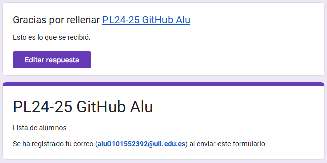
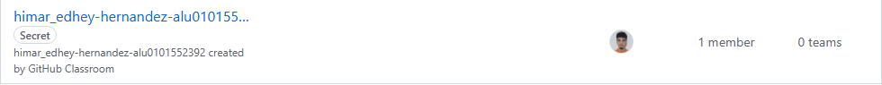
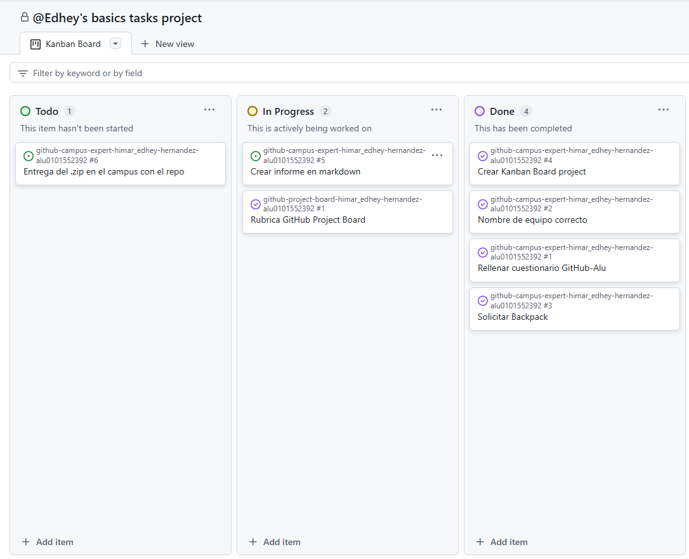

# Github Campus Expert 

- Nombre: Himar Edhey
- Apellidos:  Hernández Alonso
- alu0101552392

## Rellenar el cuestionario GitHub-Alu del campus virtual y recibir el correo confirmándolo

## Crear equipo con nombre correcto

## Crear un project board kanban para este repositorio

## Solicitar el GitHub Backpack

